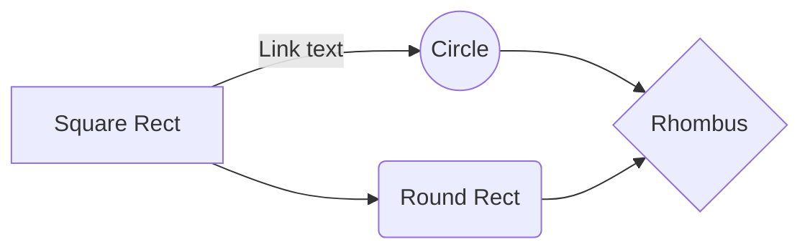

# 😵‍💫혼수상태 😵‍💫


- 잠은 왜 죽어서자나~ 죽으면 재밌는 개발도 못하는데... 😔

## 📝 정리 내용 작성 규칙

- 단순히 책을 읽고 해당 내용 토론하는 것을 넘어서, 자신의 생각을 담아서 이야기 해주세요.
- 개발자로서 살아남기 위한 자신의 생각을 적어주세요.
- 자신이 갖고 있는 철학에 대한 이야기를 적어주세요.
- 개발자로서 경력을 이어가는데 중요하게 생각하는 가치와 방법에 대해서 알려주세요.
- 성장을 이루기 위해서 자신이 핵심적으로 고려하고 있는 사항에 대해서 논의를 해주세요.
- 어떤 개발자가 되고 싶은 지에 대해서 논의를 해보아요.

#### ❗️ 그래서 자고 싶을 때, 잘 수 있는 개발자가 될 수 있도록 함께 힘내봐요! ❗️

## 📚 퀘스트 목록

## 🚀 1. “강한 놈이 오래 가는 게 아니라, 오래 가는 놈이 강한 거더라. (함께 자라기 p15) <br />

- 성장도 굉장히 중요하지만 무엇보다 살아남아야 합니다…!!!
- 용사여...! 일어나세요!!

<details>
<summary><h2 style="font-size:20px; color:orange; display: inline;">📜 퀘스트 펼치기 / 접기 📜</h2></summary>

### ✔️ ❓ 퀘스트

- 매일 오늘도 살아남기 위해 본인이 하였던 휴식을 하나씩 기록해주세요.

### ✔️ ❓ 수행 기준

- 너무 사생활이 나올 수 있느니 사진은 지양하고, 본인이 살아남기 위해 했던 내용 간략하게 작성 (ex. 밥을 대충 먹지않고 치킨을 먹었다, 체력 보충을 위해 운동을 하러 갔다 etc...)

<br/>

</details>

## 🚀 2. 조금 더 잠을 잘 자기 위해 계획을 짜볼까요?

- 인간은 잠을 자지 않으면 죽습니다..

<details>
<summary><h2 style="font-size:20px; color:orange; display: inline;">📜 퀘스트 펼치기 / 접기 📜</h2></summary>

### ✔️ ❓ 퀘스트

- 2주차에 이루고 싶은 목표를 적고 이뤄봅시다!

### ✔️ ❓ 수행 기준

1. 목표 : 2주차에 이루고 싶은 계획을 단 1개만 적어주세요.
2. 계획 : 2주차 계획을 이루기 위한 구체적인 실천 방안을 작성해주세요.
3. 평가 : 퀘스트가 제대로 이루어졌는지 확인하기 위한 구체적인 평가 방법을 적어주세요.
4. 실천 : 직접 실천해보고 목표를 이루어 봅시다.

<br/>

</details>

## 🚀 3. “’부자가 되자’라는 목표에 ‘복권을 사서 1등에 당첨된다’라는 계획을 세웠다면 불가능에 가까운 계획이라고 볼 수 있습니다.” (개발자 원칙, p.172)

- 계획은 거창하지만, 실제 행동은 불가능한 계획일 수 있습니다.
- 작은 계획을 실천으로 옮겨 성취감을 느껴보세요.

<details>
<summary><h2 style="font-size:20px; color:orange; display: inline;">📜 퀘스트 펼치기 / 접기 📜</h2></summary>

### ✔️ ❓ 퀘스트

- 매일 하나의 작은, 실천 가능한 계획을 세우고 실천해 보아요.

### ✔️ ❓ 수행 기준

- 실천 완료된 계획은 기록으로 남기고 본인을 칭찬해 주세요.

<br />

</details>

## 🚀4. “알아낸 지식은 글로 공개하라”

- 스스로 기억을 담을 수 있는 역할도 하지만, 만약 틀렸다면 이러한 오류를 확인받을 수 있기 때문...!

<details>
<summary><h2 style="font-size:20px; color:orange; display: inline;">📜 퀘스트 펼치기 / 접기 📜</h2></summary>

### ✔️ ❓퀘스트

- 학습정리 슬랙에 공개하기

### ✔️ ❓ 수행 기준

1. 목표 : 하루 한 번, 학습정리 내용을 슬랙에 공개
2. 기록하기: 학습 정리를 진행했다는 것을 README.md 파일에 기록해 주세요.

- 수정 이유 : ⇒ 체크포인트 찍기도 버거운데, 개선 작업까지 하기엔 너무 힘들어 보인다...!
  <br />

</details>

## 🚀5. "설계를 하다 보면 미리 갖추어야 할 선행 조건 역시 자연스럽게 파악할 수 있게 됩니다. (개발자 원칙, p.87)"

- 다이어그램을 그리는 능력은 개발자에게 중요한 역량입니다.

<details>
<summary><h2 style="font-size:20px; color:orange; display: inline;">📜 퀘스트 펼치기 / 접기 📜</h2></summary>

### ✔️ ❓퀘스트

- 최소 하나의 함수는 시퀀스 다이어그램으로 그려보기

### ✔️ ❓ 수행 기준

1. 최소 하나의 함수는 시퀀스 다이어그램으로 그려서 학습 정리에 업로드

> **Tip**: mermaid 사용해보세요! (아래 예시 참고)

```
graph LR
    A[Square Rect] -- Link text --> B((Circle))
    A --> C(Round Rect)
    B --> D{Rhombus}
    C --> D
```



- 수정 이유: 라이브러리 하나도 굉장히 방대하다, 수박 겉핥기 식의 학습이 이뤄질 수도 있다.
  <br />

</details>

## 🚀6. "개발 전문가들은 사회 자본, 즉. 인맥이 훌륭합니다. (함께자라기 p.43)"

- 혼자만 미션에 몰두하다보면 힘들어집니다. 팀원들에게 좋은 메시지를 보내며 힘나게 하루를 마무리합시다!

<details>
<summary><h2 style="font-size:20px; color:orange; display: inline;">📜 퀘스트 펼치기 / 접기 📜</h2></summary>

### ✔️ ❓퀘스트

- 슬랙 하루 메시지 보내기

### ✔️ ❓ 수행 기준

- 슬랙 하루 메시지를 보내는 것으로 판단해요!
  <br />

</details>

## <br />

# Week2 Relay Project 토론 결과

## S035\_송영훈

**책 제목: 개발자 원칙**

- **알아낸 지식은 글로 공개하라:** 스스로 기억을 담을 수 있는 역할도 하지만, 만약 틀렸다면 이러한 오류를 확인받을 수 있기 때문
- **기술을 공부할 때 왜 이러한 기술이 생겨났는지 먼저 생각함:** 좀 더 깊은 지식을 채울 수 있는 기회가 될 수 있다. 또한 순간 떠오르는 의문에 대해 깊이 아는것은 도움이 안될 수 있지만, 각 질문에 대한 해답을 근본에서 확인한것을 모으면 깊이있는 기술력을 가질 수 있을것이다.
- **디자인이란 무엇인가?:** 해석하면 설계이다. 그러면 우린 소프트웨어 디자인 패턴을 안다는것 보다 사실은 그 근간을 하는 원칙에 대해 알아야 된다. 그것이 바로 설계 원칙…?

## J061\_김주호

> 함께 자라기

- 실수
  - 실수를 어떻게 관리하고 계신가요? 실수를 예방하려고 노력하시나요, 실수를 관리하려고 노력하시나요?
  - 실수는 언제나 발생하며, 누구나 발생시킬 수 있습니다. 실수 예방에 공을 들여도, 언젠가는 실수가 발생합니다.
  - 실수 예방에 공을 들인다면, 정작 ‘시스템에서 실수가 일어나지 않겠지’하는 생각에 더 큰 실수가 생기고, 이는 걷잡을 수 없이 커집니다.
  - 만약 실수를 하셨다면, 똑같은 실수를 반복하지 않기 위해 노력하는 것도 좋지만, 똑같은 실수가 일어났을 때 어떻게 대처해야 할 지 고려해봅시다!
- 신뢰
  - 타인에게 내 생각을 전달하기 위해서는, 신뢰가 중요합니다. 아무리 객관적인 내용일 지라도, ‘객관적이다’를 걸 판단하는 것은 주관적이에요.
  - 객관에는 정답이 없습니다. 오히려 상대방과 신뢰를 쌓고, 거기에 객관적인 내용들로 상대방을 설득하면 더 성공적으로 받아들일 수 있습니다!
- 공유
  - 공유를 하면 신뢰가 쌓일까요? 오직 하나의 작품에 대해 공유를 한 경우, 여러 작품을 만들고 최선의 작품에 대해 공유를 한 경우, 여러 작품을 만들고 모든 작품에 대해 공유를 한 경우 중 신뢰성을 올릴 수 있는건 마지막 방법만이 유일했습니다.
  - 앞의 두 방법은 신뢰성이 떨어졌어요! 하나만 공유할 경우 해당 작품을 내 자신에게 투영하게 되어, 상대방의 피드백을 건전하게 받아들이지 못할 수 있습니다.
- 공감
  - 누군가 도움을 요청했을 때, 본인 기준 최선의 방법을 소개하고 있나요? 아니면 상대방의 생각의 흐름을 읽고, 공감하고, 대안을 소개하나요?
  - 전자는 오히려 상대방에게 거부감을 줄 수 있습니다. 이는 불통을 일으킬 수 있습니다. 상대방을 이해하고, 공감하고, 그 후 차근차근 대화를 통해 상대방의 입장에서 생각해 보도록 합시다.

## J200 이진우

### ► 디자인 원칙의 필요성

- 단위 코드의 원칙: KISS, DRY, YAGNI
- 객체지향 프로그래밍의 원칙: SOLID
- 그럼 소프트웨어 디자인의 원칙은?

### ► 설계의 중요성

- 디자인 = 설계
- “제품이 요구사항을 만족시키는 것을 증명하는 조건을 정의하는 행위”
- 1주차, 2주차를 거쳐 우리는 문제 해결을 위한 설계를 어떻게 해왔는가?

### ► 원칙과 현실

- SOLID 원칙에 위배되는 “디자인 악취”
- But 항상 리소스가 부족한 상황에서 개발해야 하는 현실
- 원칙을 지키며 프로그램을 작성했는데도 발생하는 버그
- 프로그래밍의 원칙을 현실에도 적용시킬 수 있는가?

### **J092\_문용균**

- 읽은 책: 개발자 원칙, 2장 ~ 3장
- 내용 정리
  - 2장. 오류를 만날 때가 가장 성장하기 좋을 때다 (강대명, 레몬트리 CTO)
    - 원칙1. 오류가 발생하면 소스코드 레벨에서 이해하자
      - 각 질문에 대한 대답을 근본적인 수준에서 확인하면, 기술력에 깊이가 더해짐
    - 원칙2. 알아낸 지식을 글로 공개하라
      - 기술 블로깅을 꼭 하시라
  - 3장. 소프트웨어 디자인 원칙 (공용준, 카카오 클라우드 테크니컬 디렉터)
    - “우리는 소프트웨어 설계를 잘못 배웠다”
      - **프로그래밍 원칙이 훌륭한 제품으로 연결되지 않기 때문**
    - 소프트웨어 설계 원칙
      - 명시적 설계 4가지 (기능, 성능, 유지보수, 미)
      - 암묵적 설계 4가지 (지속성, 전환, 운영, 개선)
    - 핵심
      - **명시적이고 측정 가능한 조건들을 설정해야 함**
      - 통합 설계 도구가 없고, 표준화가 어려운게 가장 큰 과제
  - 느낀점
    - 2장은 코드 레벨에서, 3장은 설계 레벨에서 인사이트를 얻을 수 있었다.
    - 오류를 해결하는 것이 스트레스로 느껴졌는데, 성장의 발판이라고 생각해야겠다.
    - 기능구현보다 중요한 고려사항이 많다는 것을 알게 되었다.

## J012\_공명규

**책 제목: 소프트웨어 장인 (프로페셔널리즘, 실용주의, 자부심) 2장[애자일] 7장[기술적 실행 관례]**

- 진정한 의미에서의 애자일이란?
  - 애자일은 변화에 민첩하게 대응하기 위한 새로운 패러다임이자 개발 가이드이다.
  - 그러나 오늘날 많은 기업과 개발자들은 애자일의 절차적 방법론에만 집중하고, 기술적 방법론은 경시한다.
  - 진정한 애자일이란, 두 가지 관점의 애자일을 모두 실천하여 소프트웨어 품질을 높이는 것이다.
- 기술적 실행 관례의 중요성
  - 사람들은 왜 기술적 실행 관례를 경시할까?
  - 많은 관리자, 기업 오너, 심지어 개발자들까지 기술적 실행 관례를 비효율적이라고 여긴다.
  - 그러나 기술적 실행 관례는 SW 품질 향상에 있어 중요한 요소이다.
  - SW 장인이 되기 위해서는 TDD, 테스트자동화, 페어프로그래밍, 리팩토링, CI/CD 등 실행적 관례를 습관화 하는 자세가 필요하다.

## K032\_신태환

책 제목 : 개발자 원칙

8장 제어할 수 없는 것에 의존하지 않기

- 자기만의 원칙 정하기
- 제어할 수 없는 것에 집중하지 말고 제어할 수 있는 부분에 집중하여 굳건하게 하는것이 중요하다
  - 일정한 입력에 일정한 출력을 주는 외부값의 영향을 받지 않는 순수함수와 비슷한 느낌
 
# Week3 Relay Project 토론 결과

## K025_박재우

책 제목 : 함께 자라기

협력을 통한 추상화  

저자는 협력을 통해 추상화를 쉽게 할 수 있다고 합니다. 예시로 톱니바퀴 문제에 대해 소개하고 있습니다.  

다섯 개의 톱니바퀴가 가로로 길게 연결되어 있는데, 가장 왼쪽의 톱니바퀴가 반시계 방향으로 돈다면 가장 오른쪽의 톱니바퀴는 어느 방향으로 돌까?  

이런 문제를 총 8개를 내며, 앞에 문제 7개는 톱니바퀴의 개수가 3, 4, 5, 6, 7, 8, 9이고 마지막 문제만 톱니바퀴의 개수를 131개로 했다고 합니다.  

문제를 푸는데 몇몇 사람들은 개수의 홀짝에 따라 마지막 톱니바퀴의 회전 방향이 결정되는 "추상화된 규칙"을 찾아냅니다. 그런데 혼자서 푼 경우에는 이 추상화 규칙을 14%만 찾아내었고, 둘이서 함께 푼 경우에는 58%가 찾아내었다고 합니다.  

저자는 이런 결과가 나온 이유를, 두 사람이 마주 앉아서 추상화를 어떻게 해 나갔는지로 설명했습니다. 예를 들어 처음에는 서로 허공에 톱니바퀴가 도는 흉내를 내보는데, 그 방법도 다 제각각이라 서로 대화를 합니다. 어느 쪽이 가장 왼쪽의 톱니바퀴인지, 바퀴에 번호를 붙인다던지, 반시계 방향은 0으로 시계 방향은 1로 표시한다던지 등등.  

즉, 두 사람은 서로 시각이 다르기 때문에 대화를 하며 시각을 맞추어 갈 수밖에 없고, 이 과정이 바로 추상화가 되는 것입니다. 혼자서 문제를 푼다면 이런 과정이 적으며 추상화의 필요도 덜해집니다.

## J140_송건석

책 제목: 개발자 원칙

### 이직, 분명한 이유가 필요해

- 중심이 되는 이야기: `이직에는 분명한 이유가 필요하다`
- 저자의 커리어 패스: 대기업 → 스타트업 → 대기업 → 우형 베트남 → 무신사
- 첫 직장인 CNS 에서는 기술 교류 X → 더 빠른 성장을 위해 스타트업으로 이직
- 규모 있는 조직에서 체계적인 프로세스와 문화를 경험하고 싶은 갈증 → 다시 대기업으로 이직
- 조직 문화에 기여하고 싶은 마음 (but, 현재 회사에서는 불가능) → 다른 회사로 이직
- 새로운 서비스나 도메인 경험하고 싶은 마음 → 동남아 타깃 해외 서비스 프로젝트로 이직
- 넓은 영역 경험 및 관리 경험 쌓고 싶은 마음 → 현재 회사로 이직
- `기존 환경에서 변화 모색하기`, `책임감 있는 마무리 중요`

## J262_최정민

책 제목 : 소프트웨어 장인

이번 주에 이어서 읽은 책의 내용은 계속해서 전문가로써 자부심을 가지고 본인이 작성하는 코드에 대한 책임감을 가질 것을 강조하는 내용이 주였습니다. 하지만 이 중에서도 기억에 남았던 것은 자율성, 통달, 목적의식이 있어야 한다는 것이었습니다. 여기서 말하는 자율성은 우리가 무엇을, 어떻게 언제할지 통제할 수 있는 상태를 뜻하는 것을 이야기 했습니다. 이 말의 의미는 우리가 작성하는 프로젝트나 코드에 대해서 단순히 상사가 시켜서 작성하거나 작업을 수행하는 것이 아닌 생각을 가져야 한다는 것입니다. 그리고 통달은 더 나은 프로페셔널, 더 나은 인간이 되기 위해서 계속해서 배우고 진화하여야 한다는 것이었습니다. 통달하는 것이 앞으로의 커리어 뿐만 아니라 인간으로서 성장할 수 있는 방법이기 때문에 이러한 점을 강조하였습니다. 마지막으로 목적의식인데 지금 하고 있는 일이 중요하고 무언가를 더 나아지게 하고 있다는 것을 느끼는 것을 뜻하고 아무런 이해없이 시키는 대로 일해서는 안된다는 것을 강조하였고 이 부분이 인상적이었습니다.

## J203_이채원

책 제목 : 개발자 원칙

JK님이 작성하신 4장을 읽었다. 

현재 부스트캠프 베이직, 챌린지에서 겪고 있는 과정이 책에서 JK님이 제안하고 있는 성장하기 위한 방법과 비슷한 점이 많다고 느껴져서 흥미로웠다. 특히 익숙한 언어일 때에는 한 함수를 10줄 이하로 작성해본다던가, 함수형으로만 구현해본다던가, 일부러 실수를 만들어본다던가 하는 방법들이 현재 부캠에서 하고 있는 것들과 유사하다고 생각했다. 따라서 이제 한 주 남았지만, 더 부캠에 매진해서 열심히 노력해야겠다는 생각을 결과적으로는 하게 된 것 같다!


## J036_김민우

책 제목 : 함께 자라기


- 우리는 야생 학습을 통해 성장해야한다.
	- 야생 학습은 대부분 협력적이다.
	- 야생학습은 비 순차적이다
	- 야생 학습은 자료에 한정이 없다.
	- 야생 학습은 명확한 평가가 없다.
	- 야생 학습은 대부분 정답이 없다.
	- 야생 학습은 대부분 목표가 불분명하고 바뀌기도 한다.
- 우리는 복리적으로 성장해야한다.
	-  자신이 이미 갖고 있는 것들을 잘 활용하라
		- 새로운 것을 유입시키는 데 집중하지 말고 얼마나 그 지식을 활용했는지 반성하라
		- 이미 갖고 있는 것들을 링크로 서로 촘촘히 연결하라
		- 새로운 것이 들어오면 이미 갖고 있는 것들과 충돌을 시도하라
		- 현재 내가 하는 일이 차후에 밑거름이 될 수 있도록 하라.
	- 외부 물질을 체화하라
		- 주기적으로 외부 자극을 받는다. 단, 외부 자극을 받으면 그걸 빨리 자기화해야한다.
		- 외부 물질 유입이후 생긴 내부 갈등을 해결하는 데 노력을 기우려라
	- 자신을 개선하는 프로세스에 대해 생각해 보라.
		- 예컨대 나의 작업을 피드백하는 프로세스를 만들어라
		- 나를 개선하는 과정을 어떻게 개선할지 고민하라
	- 피드백을 자주 받아라
		- 회고 사이클을 줄여라
		- 일짝, 자주 실패하라
	- 자신의 능력을 높여주는 도구와 환경을 점진적으로 만들어라
		- 완벽한 도구와 환경을 갖추는 데 집착해선 안된다.


## S070_최우진

책 제목 : 개발자의 원칙

7장 프로덕트 중심주의

- p.191, "오랜 기간 동안 유지한 목표이자, 가장 기본이 되는 제1 원칙은 바로 '프로덕트에 집중하자입니다.'"

  - 개발을 공부할 때 막연한 목표 보다는 구체적인 목표 설정이 중요하다는 생각이 들었습니다.

- p.198, "혼자 하는 작업이더라도 다른 이, 혹은 미래의 나와 협업하는 상황을 고려하여 작업하면 도움이 됩니다."

  - 항상 코드를 작성할 때 급하게 하지 말고 누군가가 읽어야 하는 코드라고 생각하고 코드를 작성하면 좋을 것이라고 생각이 들었습니다.


