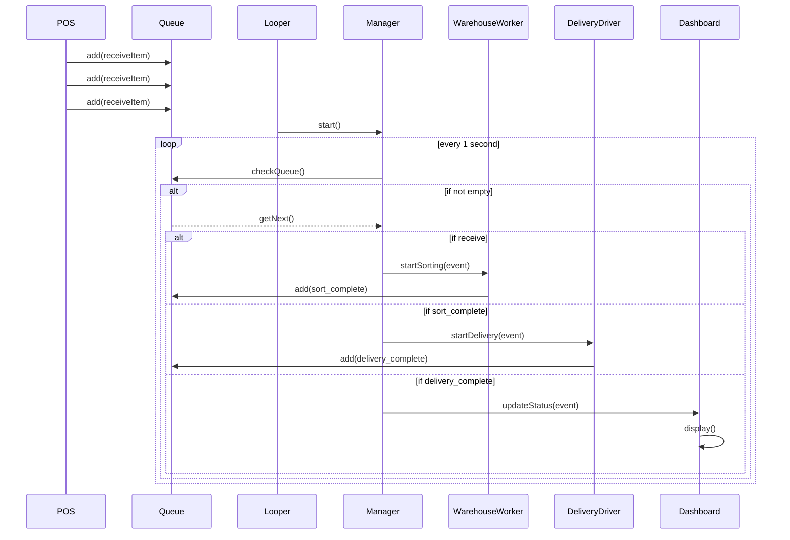

# Week2 J091 퀘스트 수행 일지

## 선택한 퀘스트

- [시퀀스 다이어그램 그리기](https://github.com/boostcampwm-2024/relay-note41/blob/main/QUEST.md#5-%EC%84%A4%EA%B3%84%EB%A5%BC-%ED%95%98%EB%8B%A4-%EB%B3%B4%EB%A9%B4-%EB%AF%B8%EB%A6%AC-%EA%B0%96%EC%B6%94%EC%96%B4%EC%95%BC-%ED%95%A0-%EC%84%A0%ED%96%89-%EC%A1%B0%EA%B1%B4-%EC%97%AD%EC%8B%9C-%EC%9E%90%EC%97%B0%EC%8A%A4%EB%9F%BD%EA%B2%8C-%ED%8C%8C%EC%95%85%ED%95%A0-%EC%88%98-%EC%9E%88%EA%B2%8C-%EB%90%A9%EB%8B%88%EB%8B%A4-%EA%B0%9C%EB%B0%9C%EC%9E%90-%EC%9B%90%EC%B9%99-p87)

- 설계하는 과정에서 필요하다고 생각했습니다.

## 수행 내용

day11 미션 1

